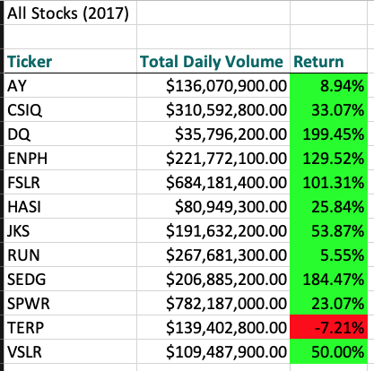
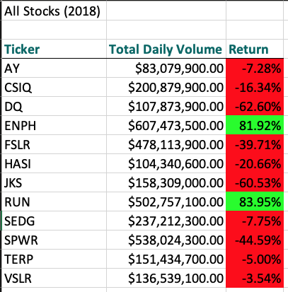
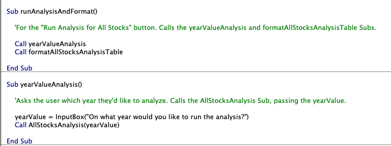

#  VBA of Wall Street

## Overview of Project

Steve wants to facilitate his parents' investments into green energy stocks.

His parents have already invested their allotted investment amount in `DAQO (DQ)`.

As a result, Steve wants to look into `DQ`'s performance. Additionally, he'd like to diversify their funds.

Using Visual Basic for Applications (VBA), we will ensure our stock dataset can be analyzed quickly and with minimal room for error. As above, we will be concerned with specifically looking at `DQ`'s performance; we will also be creating a repeatable analysis of the Total Daily Volume and Return data for all stocks in 2017 and 2018.

## Results

2017 was an excellent year for investing in green energy stocks. Particularly, Steve's parents' investment in `DQ` yielded just shy of a 200% return!

Conversely, 2018 saw a drastic reduction in returns for investors in green energy stocks. However, `ENPH` and `RUN` performed exceedingly well that year.

Of note is `RUN`'s performance. While 2017 saw only a 5.55% return with this stock, the next year saw an 83.95% return, making it the best performer of 2018. This year-over-year increase, especially given the poor return of nearly all other stocks in 2018 hints that `RUN` may continue to be a solid performer in future years.

See analysis details in the screenshots below.

#### 2017 All Stock Analysis

#### 2018 All Stock Analysis

#### Code Performance
Expand for details about runtime for both the original and refactored VBA scripts.

  
Runtime Comparison, Original vs. Refactored

| **year**   | **runtime (original)** | **runtime(refactored)**  |  **delta in runtime** |
|:------:|:--------------:|:-------------:|:------------:|
| 2018   | 0.7929688s     | 0.1015625s    | -87.2%      |
| 2017   | 0.7929688s     | 0.109375s     | -86.2%      |

## Summary

#### Advantages & Disadvantages of Refactoring Code

Refactoring code offers multiple advantages. Developing a thorough understanding of existing code is hugely important. An organization with well-understood (and documented!) code will be able to make swift adjustments in the face of changes. Refactoring presents an opportunity for both education and documentation.

However, it is paramount that a clear definition of "done" is settled on before refactoring occurs. A team or individual should aim to answer these kinds of questions in advance of changing code:
* "What performance benchmarks are we hoping to hit?"
* "What benefits does this refactor offer internally or to the end-user?"
* "How might proposed changes impact other systems, e.g. existing code, other teams, ongoing in-progress projects?"

#### Advantages & Disadvantages of Original vs. Refactored VBA Script

The original VBA script offered two advantages to my mind:
1. the process of creating it step-by-step gave an intimate understanding of both the problem at hand as well as the dataset
2. there were opportunities to make code more modular, meaning one could easily extend functionality of an existing subroutine; see the example below

###### _Here, I was able to create a subroutine that called the `yearValueAnalysis` and `formatAllStocksAnalysisTable` subroutines, meaning I could, make adjustments to formatting without impacting the analysis subroutine, for example; similarly the `yearValueAnalysis` subroutine's only job is to ask the user which year they'd like to analyze_

However, a major disadvantage of the original VBA script is that it performs more slowly. When working with large datasets, it is especially important to have highly performant and efficient code. Looping over both the tickers as well as the rows of the given sheet also means more code complexity and, therefore, more potential for error.

A disadvantage of this refactor meant working with a template and, thus, I had to familiarize myself with the existing structure. At times, I found myself in the weeds, aiming to understand the template instead of the problem at hand.

Finally, a _huge_ advantage of the refactored script was that it allowed for up to an ~87% decrease in runtime. Refer to the [table above](#code-performance) for more detailed performance data.
